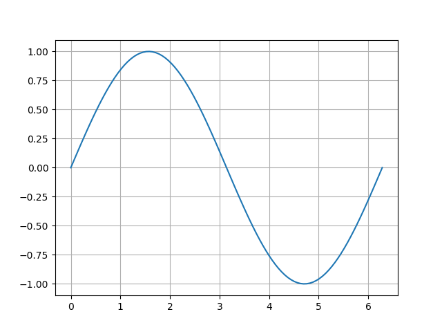

py2md
=====

Convert a python script to markdown. Useful for presenting code to your co-workers.

Install
-------

    sudo ln -s $PWD/py2md /usr/local/bin/

Usage
-----

Use three single quotes `'''` on a line by themselves in your python script to
switch between code and markdown mode. When done, run:

    py2md README.py > README.md

Example
-------

Import numpy and matplotlib.


```python

import numpy as np
import pylab as plt


```

### Plan
1. define utility functions
2. compute <a href="https://www.codecogs.com/eqnedit.php?latex=sin(x)" target="_blank"></a>
3. plot


```python

def my_sin(x):
    '''This is a docstring'''
    return np.sin(x)

x = np.linspace(0, 2 * np.pi, 100)
y = my_sin(x)

plt.plot(x, y)
plt.savefig('plot.png')


```



